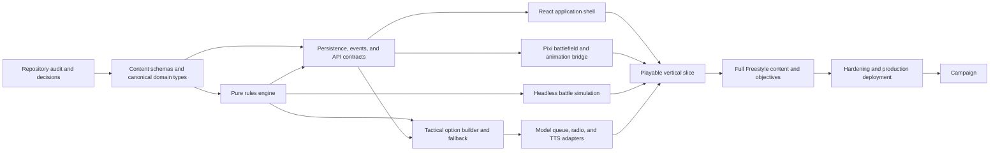

# Cursor Execution Plan

This plan is written for a lead Cursor agent using planning mode and bounded specialist-agent loops. It is an execution contract, not a request to implement every document simultaneously.

## 1. Opening Directive For Cursor

Read every Markdown file in this specification folder before changing code. Then inspect the actual repository, current tests, migrations, Docker configuration, and dirty worktree. Produce a requirement-linked plan and repository impact map. Do not assume the copied Story Engine file list or endpoint list is still accurate.

Implement one delivery gate at a time. Keep the game playable without model, TTS, or final art providers. Never let language-model output, browser state, animation, or narration become mechanical authority.

When repository evidence conflicts with this package:

1. Preserve the product invariant.
2. Prefer an incremental adapter over a destructive rewrite.
3. Record the conflict and proposed resolution in the decision log.
4. Ask Raymond only when the choice changes product behavior, discards data, or materially expands scope.

## 2. Required Planning Output Before Edits

Create or update implementation documentation in the repository with:

- Existing-system inventory: services, entry points, schemas, migrations, APIs, frontend shell, Pixi usage, agent/provider integration, tests, and deployment.
- Legacy map: what can be retained, adapted, migrated, or removed later.
- Requirement traceability table linking this spec's IDs/gates to code areas and tests.
- Risk register ranked by impact and uncertainty.
- Gate 0 task list with dependencies, owners/workstreams, and verification commands.
- Explicit list of product questions that truly block Gate 0. Tuning questions do not block architecture.

Do not begin broad code generation until this inventory is complete.

## 3. Workstream Boundaries

### Lead/Integration Agent

Owns architecture, plan/status, cross-workstream contracts, migrations order, integration, and final verification. It reviews specialist work and prevents parallel edits to the same files.

### Domain Rules Agent

Owns domain entities, seeded RNG, coordinates, movement, LOS, combat, actions, effects, objectives, deployment, and pure tests. It does not edit UI presentation or prompts.

### Content And Balance Agent

Owns schemas, catalogs, roster data, opposition builder, maps, mission data, prompt/asset references, and content validation. It does not hide mechanics in prose or code.

### Persistence And API Agent

Owns migrations, repositories, transactions, idempotency, event/outbox, DTOs, OpenAPI, REST/SSE, and integration tests. It consumes domain contracts; it does not recalculate rules in route handlers.

### Agent Orchestration Agent

Owns context builder, option serialization, provider adapters, activation queue, validation, fallback scoring, artifacts, radio, and fake-provider tests. It cannot mutate state except through application/domain use cases.

### Frontend Application Agent

Owns Mission Prep, battle shell, DOM controls, initiative, inspector, directives, communications, Debrief, settings, accessibility, API client, and responsive layouts. It does not implement canvas internals or mechanical calculation.

### Pixi/Media Agent

Owns scene, projection, camera, layers, hit testing, animation queue, asset/audio manifests, Pixi lifecycle, and visual tests. It consumes backend snapshots/events and emits semantic selections.

### QA/Release Agent

Owns test harnesses, fixtures, end-to-end scenarios, simulation/soak, accessibility checks, security/dependency review, Docker verification, telemetry validation, and release evidence. It may file defects but should not silently redefine expected behavior.

## 4. Parallelism Rules

- Parallelize investigation and isolated modules, not shared contracts.
- Freeze or review domain/API schemas before frontend, agent, and Pixi consumers implement against them.
- Give each specialist an explicit file ownership list.
- Specialists return patches plus tests and assumptions to the lead; the lead integrates and reruns the gate suite.
- Never let two agents independently invent Unit, Event, ActionOption, or BattleSnapshot shapes.
- Run serial correctness before enabling agent prefetch concurrency.
- Keep final content/art generation separate from code architecture so placeholders can validate contracts.

## 5. Dependency Flow



## 6. Gate 0: Repository And Contract Foundation

### Deliverables

- Repository inventory and legacy migration map.
- Canonical terminology and IDs.
- Versioned Pydantic/content schemas with precise validation errors.
- Seeded RNG abstraction and deterministic test fixture.
- Domain event envelope, state version, command ID/idempotency design, and transactional outbox migration.
- Session/prep lifecycle and boot/catalog APIs.
- OpenAPI client generation path.
- Docker health checks and clean-start migration/content validation.

### Verification

- Empty and representative legacy database migrations pass.
- Invalid content fixture fails with exact path/reason.
- Same seed produces same sample rolls/force selection.
- Repeated prep/deploy command receipts behave idempotently.
- Frontend can load boot catalog and create/restore draft session.

### Do Not Add Yet

No model provider, prefetch, procedural maps, campaign, final art, or broad UI restyle.

## 7. Gate 1: Headless 15-Point Battle

### Recommended Order

1. Axial grid, map fixture, terrain, occupancy.
2. Unit/model instances and actions.
3. Pathfinding and squad formation.
4. LOS, range, and cover.
5. Attack, damage, destruction, and events.
6. RAM, signal, three VS abilities/statuses.
7. Initiative and activation state machine.
8. Automated deployment.
9. 15-point catalog and deterministic opposition builder.
10. Annihilation victory/defeat and Debrief projection.
11. Fallback-vs-fallback headless simulation.

### Gate Test

From one command/test entry point, create a seeded 15-point battle, run it to terminal state, replay its events, and assert identical projection and no invariant failure.

Do not use an LLM in this gate.

## 8. Gate 2: Playable Local Vertical Slice

### Backend/API

- Deploy and battle snapshot.
- SSE event stream/replay.
- Direct commander legal option endpoints.
- Directives and end-activation.
- Agent activations temporarily use deterministic fallback.

### Frontend

- Dismissible first-run tutorial placeholder.
- Mission Prep through deploy.
- Responsive battle shell.
- Initiative strip, selected-unit inspector, action tray, directive composer, communications, and Debrief.
- DOM alternatives for canvas targets/destinations.

### Pixi

- Prepared map, base texture placeholder, terrain placeholders, units, required layers, camera, hit testing, overlays, and basic event-driven animations.
- Proper cleanup and reconnect snap.

### Gate Test

A keyboard-only user can build, deploy, directly act with the commander, observe fallback units, and reach Victory or Defeat in a browser. Refresh during battle restores exact state.

## 9. Gate 3: Model Agents, Radio, And TTS

### Recommended Order

1. Versioned prompt files and context builder.
2. Tactical option serialization and one-tool decision schema.
3. Fake provider adapter and artifact records.
4. Serial decision loop with timeout and fallback.
5. Post-resolution friendly radio composer.
6. TTS adapter/cache/queue and independent mute.
7. Stale-choice revalidation.
8. Only then enable bounded prefetch up to five.

### Gate Tests

- Fake responses cover malformed, timeout, stale, defeated, and reverse-order cases.
- Provider-disabled battle remains unchanged and complete.
- No model output can directly set coordinates, rolls, HP, RAM, objective, or victory.
- Radio always follows commit and matches resolved facts.

## 10. Gate 4: Full Freestyle MVP

Implement in vertical slices by rule family:

1. Full soldier and drone catalog.
2. Six commander loadouts and seven RAM abilities.
3. Ammunition, resupply, recovery, smoke, paint, mines, and transport.
4. All point caps and role-aware opposition forces.
5. Full terrain catalog and asset set.
6. Template-based seeded map generation with validator/fallback.
7. Control and Extraction objectives.
8. Complete Debrief/rematch/feedback.

For each family, add content, rules, API projection, UI, Pixi cues, agent options, fallback weights, and tests together. Do not add a rule that only the backend or only the picture understands.

### Gate Test

Every point cap produces and completes seeded battles on every supported objective/map family. A 100-point battle supports twenty unit agents without illegal state or deadlock.

## 11. Gate 5: Hardening

- Responsive and 200% zoom corrections.
- Keyboard, screen-reader, reduced-motion, captions, and color-independent states.
- Rendering/performance profiling and leak checks.
- SSE/database/provider failure drills.
- Security controls, rate limits, session access, CSP/CORS, redaction, retention, and cost caps.
- Docker clean-checkout verification.
- Production migration/backup/rollback and Railway verification.
- Release simulation and browser suites.
- Final approved assets/media manifest.

No optimization is accepted without before/after evidence, and no visual polish may remove accessible controls or mechanical clarity.

## 12. Gate 6: Campaign

Implement generic objective/script/tutorial/progression data first. Then add missions one at a time in point order, each with headless objective tests and a browser playthrough. Mission code may not bypass the generic command/event path.

## 13. Status Discipline

Maintain a short `IMPLEMENTATION_STATUS.md` in the repository:

```text
Current gate
Completed requirements
In-progress task and owner
Next tasks
Decisions/assumptions added
Known failures or debt
Verification last run
```

Update it as tasks complete, not only at the end. Keep one integration task in progress at a time even when specialists work in parallel.

## 14. Decision Discipline

The following do not require Raymond to unblock code:

- placeholder art/audio
- tuning constants already marked TUNING
- exact internal class/file names matching repository convention
- whether serial agent execution precedes concurrency
- test fixture names

Ask Raymond before:

- changing the core dice/action economy
- changing point caps, roster identity, or commander-death condition
- making avatars mechanically different
- adding real-world factions/conflicts
- enabling permanent campaign loss/progression economy
- introducing paid-provider behavior without fallback/caps
- deleting legacy data or unrelated user code
- materially changing the product scope or public deployment model

## 15. Integration Checklist Per Task

Before a specialist task is accepted:

- Requirement/decision is cited.
- Files changed match assigned ownership.
- Mechanical behavior has backend tests.
- Public schema changes update OpenAPI/client fixtures.
- Content changes validate.
- UI has disabled/loading/error/accessibility states.
- Pixi change handles hydration, replay, reconnect, and reduced motion.
- Agent change has fake-provider failure cases.
- No secret, raw provider payload, or hidden information leaks.
- Docker-relevant behavior is verified when affected.

## 16. Final Handoff Evidence

For each completed gate, provide Raymond:

- concise behavior summary
- requirement coverage and deliberate deferrals
- test/build commands and results
- screenshots or short recordings for player-facing work
- known tuning risks
- decisions added
- exact local URL or deployment URL

Do not call a gate complete because code was generated. Call it complete when its acceptance scenario works and the evidence is available.

